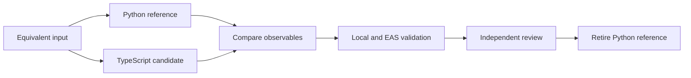
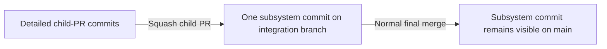
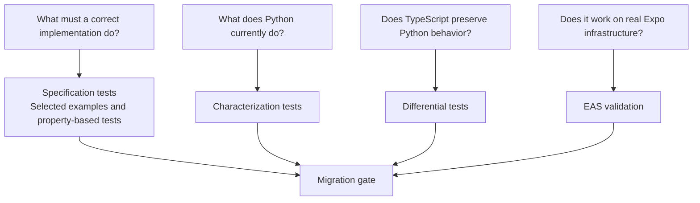
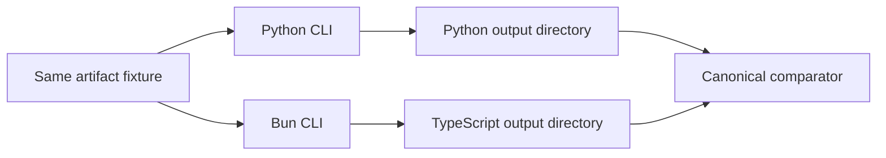
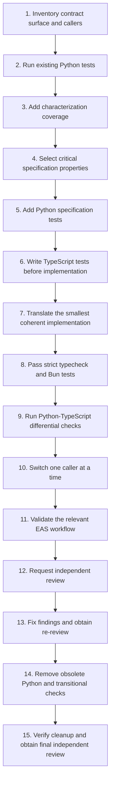

# Migration and Testing Guide

This guide defines how we will carry out and test the migration from Python to
TypeScript running on Bun. It is written for contributors who know Python but
may be new to JavaScript, TypeScript, Bun, property-based testing, or stacked
pull requests.

The migration goal is behavioral preservation. Active Python runtime code will
be replaced one bounded slice at a time while preserving observable behavior,
project structure, workflow interfaces, artifact formats, and evaluator
semantics. A language change is not an opportunity to silently redesign the
product or fix unrelated defects.

Although examples refer to this repository, the method is deliberately stated
in language-independent terms where possible. That keeps the useful parts
available for a future, generalized migration guide or reusable skill without
adding skill-packaging work to the migration itself.

## Migration shape

Work in bounded slices with explicit public boundaries. A slice might be one
helper, one parser, or one evaluator subsystem. It should be small enough that
its inputs, outputs, callers, side effects, and failure behavior can be listed
and compared, but large enough to represent a coherent behavior rather than an
arbitrary group of lines.

During a slice, Python is the **reference implementation**: it supplies the
current behavior being preserved. TypeScript is the **candidate
implementation**: it must first demonstrate compatibility before it replaces
Python.



Keep the Python implementation and transitional differential checks available
through substantive independent review. Review findings often reveal an
observable that the original characterization cases missed. Keeping the
reference runnable lets us determine what Python really did and add an honest
regression case before changing or deleting it.

After the candidate passes local, differential, and EAS checks:

1. Request independent review while both implementations and their comparison
   evidence are still available.
2. Turn valid review findings into regression cases, fix the candidate, and
   request re-review.
3. Remove Python and migration-only differential machinery only after no
   substantive candidate findings remain.
4. Rerun the complete gate after removal, then obtain independent review and
   normal human PR approval for the complete post-retirement diff.

The permanent TypeScript regression and specification tests remain after the
reference implementation is retired.

## Branch, commit, and merge discipline

Detailed working history and clean project history serve different audiences.
Working commits help reviewers understand how a slice developed. The
integration branch and `main` should emphasize stable subsystem milestones.

Prefer coherent, green working commits. A red test run is required evidence in
test-driven work, but it does not require its own commit. Record the command and
expected failure in the evolving `MIGRATION_STATUS.md` working copy. Once the
logical change is green, commit the tests and implementation together. If a
slice is large, use a few reviewable commits organized by purpose; do not
create a commit for every status-line edit or command result.

After fresh checks and review establish an exact green head commit, create at
most one evidence/review roll-up commit for the slice. That roll-up changes
only documentation or status records and names the immutable implementation
commit that was actually tested and reviewed. It does not need to contain its
own hash. The child PR and its eventual squash merge identify the roll-up
itself. If the supposed roll-up changes runtime code or tests, it is not merely
an evidence update: create a new implementation commit, rerun the gates, and
record that new tested head instead.

```text
Working branch:
    one or a few green implementation commits
        -> fresh checks and review at an exact head
        -> at most one evidence/review roll-up commit

Integration and main:
    approximately one stable commit per migrated subsystem
```

The Git terms used below mean:

- **Squash merge:** GitHub combines all commits in one PR into one new commit
  on its base branch.
- **Rebase with `--onto`:** Git copies only the selected child-branch commits
  from an old parent onto a new parent.
- **Retarget:** Change a PR's base branch in GitHub.
- **Force-push with lease:** Replace a rebased remote branch, but refuse if
  someone else pushed work that the local repository has not seen.

For the rolling PR stack in this repository, squash only the lowest PR whose
base is `codex/migrate-to-ts`. Suppose the current stack is:

```text
codex/migrate-to-ts
└── codex/ts-migration-docs       PR A
    └── codex/ts-toolchain        PR B
        └── codex/ts-timeout      PR C
```

When PR A is approved:

1. Make every affected worktree clean, fetch the remote, and record the exact
   old tips of PR A and PR B. Replace the placeholders below with those hashes;
   they are the boundaries that prevent Git from replaying ancestor work.
2. Squash-merge PR A into `codex/migrate-to-ts`. Do not delete PR A's remote
   branch yet.
3. After the squash merge completes, fetch the remote again. In PR B's
   worktree, replay only B's own commits with:

   ```bash
   git fetch origin
   git rebase --onto origin/codex/migrate-to-ts <old-PR-A-tip>
   git push --force-with-lease origin codex/ts-toolchain
   ```

4. Retarget only PR B from `codex/ts-migration-docs` to
   `codex/migrate-to-ts`. Once no open PR uses PR A as its base, its remote
   branch may be deleted.
5. In PR C's worktree, fetch the rewritten PR B and replay only C's own
   commits onto it:

   ```bash
   git fetch origin
   git rebase --onto origin/codex/ts-toolchain <old-PR-B-tip>
   git push --force-with-lease origin codex/ts-timeout
   ```

6. Keep PR C based on its immediate parent, `codex/ts-toolchain`. Apply the
   same old-parent-tip procedure to any deeper descendant in parent-to-child
   order.
7. Inspect every resulting PR diff, rerun affected checks, and request review
   again when a rebase materially changes reviewed content.

After PR A is integrated and the remaining branches are restacked:

```text
codex/migrate-to-ts              includes squashed PR A
└── codex/ts-toolchain           PR B, retargeted
    └── codex/ts-timeout         PR C, still based on PR B
```

A plain `git rebase codex/migrate-to-ts` is unsafe here because the new squash
commit has a different identity from PR A's original commits. Git may try to
replay those already-integrated commits. The old parent tips and `--onto`
commands state exactly which commits belong to each child.

When the migration is complete, merge the umbrella PR from
`codex/migrate-to-ts` into `main` using GitHub's **Create a merge commit**
strategy. Do not squash it again if the individual subsystem commits should
remain visible.



This gives child PRs detailed review history while keeping the permanent
history readable. The PR conversation, checks, and `MIGRATION_STATUS.md` retain
the audit trail even when intermediate commits are not copied individually to
`main`.

## The evidence model

Every migrated slice uses four kinds of evidence. Each answers a different
question.



No single lane answers all four questions:

- Characterization can preserve an existing bug.
- Specification can describe correct behavior without proving parity.
- Differential comparison can show that two implementations are equally
  wrong.
- EAS can prove deployment compatibility without exercising every edge case.

The evidence is strongest when all applicable lanes agree.

## Test scope and test purpose are separate

Test scope describes how much of the system runs:

| Scope | Meaning | Example |
| --- | --- | --- |
| Unit | One small function or class is exercised in isolation. | Parse one test-plan string. |
| Integration | Several modules or a process boundary are exercised together. | Run the skill evaluator CLI against a fixture directory. |
| End to end | The user-facing system runs across its real infrastructure. | Run an EAS workflow that authors and evaluates an app. |

Test purpose describes where the expected answer, or **oracle**, comes from:

| Purpose | Oracle | Question answered |
| --- | --- | --- |
| Characterization | Observed Python behavior | What does the current implementation do? |
| Specification | A product rule, schema, mathematical model, or other independent contract | What must any correct implementation do? |
| Differential | Agreement between Python and TypeScript | Do the two implementations behave the same? |

An oracle is simply the source of the expected answer. A test can therefore be
a unit characterization test, an integration specification test, or an end-to-
end differential test. “Unit” and “characterization” are not competing labels.

## Characterization tests

A characterization test records behavior that Python exhibits today. It does
not claim that the behavior is ideal. Its purpose is to make migration drift
visible so that any behavior change becomes a deliberate decision.

For example:

```python
def test_characterization_invalid_timeout_exit_code(self):
    """Characterization: preserve Python's invalid-timeout response.

    Oracle: captured exit code and stderr from the existing Python CLI.
    """
    result = run_timeout_cli("not-a-number", "true")

    self.assertEqual(result.returncode, 2)
    self.assertEqual(result.stderr, "invalid timeout: not-a-number\n")
```

The assertion means “Python currently returns this,” not “exit code 2 is the
only correct design.” If the behavior is later judged to be defective, change
it in a separate behavior-change PR after the migration slice is stable.

Characterization cases should cover observable behavior such as:

- Return values and raised errors.
- Process exit codes, stdout, and stderr.
- Created files and directories.
- JSON keys, values, and ordering where ordering is meaningful.
- External commands, arguments, and environment variables.
- Cleanup and resource effects.

Fixtures should be small enough to understand. If a real artifact is large,
reduce it to the smallest fixture that still demonstrates the behavior being
protected.

## Specification tests

A specification test checks behavior that must remain true regardless of the
implementation language. Its oracle comes from outside the production
function: a product requirement, artifact schema, security rule, mathematical
model, or independently maintained reference model.

For example, the evaluator rule “earned points may not exceed maximum points”
is independent of both Python and TypeScript:

```python
def test_spec_score_001_earned_points_remain_bounded(self):
    """Property: earned points remain within [0, max_points].

    Oracle: mathematical bounds and an independent assertion-count model.
    Catches: negative scores, overflow, and scores above the maximum.
    """
    result = score_step(generated_step(max_points=5, accepted=20))

    self.assertGreaterEqual(result.earned_points, 0)
    self.assertLessEqual(result.earned_points, 5)
```

Not every behavior needs a new specification test during migration. We select
behaviors that are both critical and plausibly bug-prone.

### Critical behavior

A behavior is critical when a defect could:

- Corrupt evaluation results.
- Lose or expose data.
- Produce unsafe filesystem effects.
- Leak processes or other resources.
- Break an artifact or workflow contract.
- Prevent an EAS workflow from completing.

### Bug-prone behavior

A behavior is plausibly bug-prone when it contains:

- Many input combinations or state transitions.
- Numeric boundaries or ordering rules.
- Path normalization or archive extraction.
- Asynchronous work or process boundaries.
- Deduplication or aggregation.
- Complex error handling.
- Weak existing test coverage.

Critical behavior that is unsuitable for property-based testing still receives
example-based tests. Process timing, simulator startup, shell quoting, LLM
trajectories, and real network failure are usually clearer and more reliable as
targeted examples.

## Natural-language property catalog

Language-independent properties live in `test_properties.json` and are
validated by `test_properties.schema.json`. The catalog is semantic: it says
what must be true, why, and how the expected result can be established without
using the implementation under test.

Operational data such as migration status, PR links, test commands, coverage,
and EAS run IDs belongs in `MIGRATION_STATUS.md`. The stable property ID joins
the two records without mixing the contract with project-management details.

Validate the schema itself, the catalog structure, and property-ID uniqueness
after every catalog edit:

```bash
uv run --with jsonschema python -c 'import json; from pathlib import Path; from jsonschema import Draft202012Validator; schema=json.loads(Path("test_properties.schema.json").read_text()); catalog=json.loads(Path("test_properties.json").read_text()); Draft202012Validator.check_schema(schema); Draft202012Validator(schema).validate(catalog); print("schema and catalog valid")'

PYTHONPATH=. uv run python -m unittest \
  eval_harness.utils.tests.test_property_catalog
```

JSON Schema's `uniqueItems` compares complete objects. It cannot reject two
different property objects that reuse the same `id`. The repository test above
therefore enforces uniqueness of the stable join key separately.

Property discovery follows this sequence:

```mermaid
flowchart LR
    C["Read contract surface<br/>docs, signature, docstring"] --> P["Write candidate in JSON"]
    P --> O["Name an independent oracle"]
    O --> R["Reject weak or circular properties"]
    R --> U["User reviews property"]
    U --> I["Inspect implementation"]
    I --> G["Design generator"]
    G --> H["Write Hypothesis test"]
    H --> F["Write fast-check equivalent"]
```



Before using the implementation body to discover a property:

1. Read documented behavior, signatures, types, error descriptions, schemas,
   and adjacent interface context.
2. Define the valid input domain, output domain, side effects, preconditions,
   and errors.
3. Consider applicable property categories:
   - Round-trip behavior.
   - Algebraic relations.
   - Comparison with an independent model.
   - Metamorphic relations, where changing input in a known way implies a
     predictable output change.
   - Invariant preservation.
   - Stateful or model-based behavior.
   - Error and partial-input behavior.
   - Monotonicity and numeric bounds.
4. State the independent oracle.
5. Reject candidates that merely restate the implementation.
6. Ask the user to approve the property record.
7. Inspect the implementation to refine generators and identify edge cases,
   without changing the approved claim to match accidental implementation
   details.

A selected property must:

- Protect behavior that is critical and plausibly bug-prone.
- Be supported by named sources clause by clause.
- Be falsifiable: some plausible faulty implementation must fail it.
- Use an oracle independent of the production implementation.
- Catch at least two plausible defect classes when practical.
- Have observable results.
- Admit a valid, useful, and shrinkable generated input domain.
- Avoid rejecting behavior that the contract permits.
- Avoid duplicating another property.

### Property anti-patterns

Reject or rewrite a candidate when it has one of these problems:

- **Tautology:** it is true by definition and cannot catch a defect.
- **Self-oracle:** it computes the expected answer with the function being
  tested.
- **Implementation re-expression:** the test copies production branches line
  by line and therefore tends to copy the same bug.
- **Weak claim:** it only checks that the program did not crash or that a value
  has a broad type.
- **Invalid domain:** it generates inputs that callers are forbidden to send.
- **Filtering-heavy generator:** it generates mostly invalid inputs and rejects
  them, preventing useful exploration and shrinking.
- **Compound property:** it combines unrelated claims whose failures would be
  difficult to diagnose.

## Property-based testing

A normal example test chooses a few inputs manually. A property-based test
describes a valid input space and lets a library generate many examples,
including boundary cases. Hypothesis is the Python library; fast-check is the
TypeScript library.

When a generated example fails, the library attempts to **shrink** it. Shrinking
means finding a smaller failure, such as changing a list of 50 records into the
single record that reveals the defect. This is why generators should construct
valid structured inputs directly instead of generating arbitrary data and
discarding almost all of it.

Python example:

```python
@given(
    max_points=st.integers(min_value=0, max_value=10_000),
    accepted=st.integers(min_value=0, max_value=10_000),
)
@example(max_points=0, accepted=0)
def test_spec_score_001_earned_points_remain_bounded(
    self,
    max_points: int,
    accepted: int,
) -> None:
    """Property: earned points remain within [0, max_points].

    Oracle: mathematical bounds and an independent assertion-count model.
    Catches: negative scores, overflow, and scores above the maximum.
    """
    step = generated_step(max_points=max_points, accepted=accepted)
    result = score_step(step)

    self.assertGreaterEqual(result.earned_points, 0)
    self.assertLessEqual(result.earned_points, max_points)
```

TypeScript equivalent:

```typescript
test("[SPEC SCORE-001] earned points remain bounded", () => {
  // Property: earned points remain within [0, maxPoints].
  // Oracle: mathematical bounds and an independent assertion-count model.
  // Catches: negative scores, overflow, and scores above the maximum.
  fc.assert(
    fc.property(
      fc.integer({ min: 0, max: 10_000 }),
      fc.integer({ min: 0, max: 10_000 }),
      (maxPoints, accepted) => {
        const step = generatedStep({ maxPoints, accepted });
        const result = scoreStep(step);

        expect(result.earnedPoints).toBeGreaterThanOrEqual(0);
        expect(result.earnedPoints).toBeLessThanOrEqual(maxPoints);
      },
    ),
  );
});
```

Use these generator rules in both languages:

- Generate valid structured inputs directly.
- Use composite strategies or arbitraries for related values.
- Avoid broad generation followed by heavy filtering.
- Include explicit boundary examples.
- Exclude NaN and infinity unless they are part of the input contract.
- Use a state machine when correctness depends on a sequence of operations.
- Preserve useful shrinking.

When Hypothesis or fast-check finds a defect:

1. Record the smallest failing example.
2. Promote it into an explicit regression case or `@example`.
3. Record its property ID and classification in `MIGRATION_STATUS.md`.
4. Do not weaken the property merely to make the test pass.
5. Do not suppress health checks to hide a poor generator.
6. Do not commit a large opaque generated-example database when a small,
   explicit example preserves the regression.

If a specification property fails against existing Python, record it as an
existing defect. Keep the specification and parity questions separate:

```text
Specification result: Python violates SCORE-001 for this minimized input.
Parity result:        TypeScript preserves Python's existing behavior.
```

Unless the defect threatens security or data loss, preserve the behavior for
the migration and correct it later in a separate behavior-change PR. This keeps
language translation and product redesign independently reviewable.

## Differential tests

A differential test supplies equivalent input to Python and TypeScript and
compares their observable results.

```text
equivalent input + two implementations + observable comparison
```

Differential testing can happen at several scopes:

```text
Unit differential:
    same test-plan text
        -> Python parser
        -> TypeScript parser
    compare parsed structures

Subsystem differential:
    same artifact fixture
        -> Python skill-evaluator CLI
        -> Bun skill-evaluator CLI
    compare output directories and process results

End-to-end differential:
    equivalent EAS workflow inputs
        -> Python-backed workflow
        -> Bun-backed workflow
    compare stable artifacts and contracts
```

A subsystem comparison normally includes:



Compare every relevant observable:

- Exit codes.
- stdout and stderr.
- JSON structure, values, and meaningful order.
- Required output files.
- Environment and subprocess calls.
- Cleanup and filesystem effects.
- HTML structure when byte equality is not part of the contract.

### Normalization rules

Some values differ on every correct run. A canonical comparator may normalize
only values that are inherently variable and explicitly understood, such as:

- A temporary directory's absolute root.
- A generated run identifier.
- A timestamp that is not part of evaluator semantics.

Normalization must not:

- Remove an unexplained mismatch.
- Delete fields merely because they are difficult to reproduce.
- Sort data when order is part of the contract.
- Round numeric results unless the contract permits that tolerance.

Every normalization rule should be named and tested. Unexpected differences
remain failures until explained and either fixed or explicitly approved.

Differential checks are transitional. Keep them through substantive review so
review-discovered compatibility questions can still be answered against the
reference implementation. Once the candidate passes re-review and Python is
removed, permanent TypeScript characterization regressions and specification
tests remain, while cross-language harness code is removed unless it still has
independent value.

### Runtime semantic parity checklist

A syntax translation can still change behavior because Python, JavaScript, and
Bun standard libraries make different default choices. For code at a runtime
boundary, inspect more than ordinary return values.

| Boundary | Compatibility questions |
| --- | --- |
| Numbers | Do both languages accept the same text grammar, including signs, whitespace, exponents, separators, non-finite values, and overflow? Do they format values identically where text is observable? |
| Processes | Are signal terminations distinguishable from explicit numeric exits? Are exit codes mapped the same way? Are process groups and descendants cleaned up? |
| Timers | Do zero, negative, fractional, non-finite, and extremely large durations behave the same? Does the runtime cap timer sizes, and are scheduled timers cancelled after early completion? |
| Streams | Are stdout and stderr kept separate? Are bytes, text encoding, buffering, ordering, and trailing newlines preserved? |
| Environment | Are missing, empty, and inherited environment variables treated the same? Are the same variables passed to subprocesses? |
| Filesystem | Are paths resolved against the same directory? Are file modes, atomic writes, symlinks, ordering, temporary paths, and cleanup effects compatible? |
| Platform | Does behavior differ across Linux and macOS workers, shells, signal implementations, path rules, or available commands? |

This checklist is not a demand to add speculative tests for every cell. Use it
to discover relevant observables from the slice's callers and implementation,
then add focused characterization or specification cases for credible risks.
When review uncovers a missed observable, reproduce it against the reference,
record the red and green evidence, and retain the minimized case as a permanent
candidate regression test.

## EAS validation

Local tests cannot reproduce the complete product surface. This repository's
real product surface is the EAS Workflow runner plus uploaded artifacts.

EAS validation checks integration with:

- Real Linux or macOS workers.
- The pinned Bun runtime.
- Shell entrypoints.
- Environment variables and credentials.
- Expo, agent-device, and Maestro tooling.
- Artifact upload and download.
- Simulator lifecycle.
- SDK integrations such as Claude Agent SDK and Braintrust.

Use the smallest relevant replay workflow during development, then use
`.eas/workflows/eval-e2e.yml` for the final slice and full cutover.

### Deterministic and agentic comparisons

The skill evaluator is deterministic for the same authored artifact. After
approved normalization, its `metrics.json`, required report structure, summary,
and exit behavior should match exactly.

The iOS evaluator contains an LLM and device automation. Two correct live runs
may choose different actions or receive different scores. Do not demand
identical trajectories. Instead:

- Compare parsers, schemas, scoring, tool adapters, cleanup, and recorded
  fixtures deterministically.
- Verify that the live EAS workflow completes.
- Verify that it produces valid, correctly named artifacts.
- Investigate large score or reliability changes without treating exact score
  equality as a universal oracle.

Record each EAS run's commit, workflow, inputs, run URL or ID, artifact IDs,
result, and explained discrepancies in `MIGRATION_STATUS.md`.

## Canonical Python suite

Run both commands whenever this guide requires the complete Python suite:

```bash
PYTHONPATH=. uv run python -m unittest discover \
  -s eval_harness \
  -p 'test_*.py'

PYTHONPATH=. uv run python -m unittest discover \
  -s eval_harness/utils/tests \
  -p 'test_*.py'
```

The second command is intentionally separate. `eval_harness/utils/` contains
script-style helpers and has no package `__init__.py`, so Python's recursive
discovery from `eval_harness` does not enter its `tests/` directory. Adding a
package marker solely for test discovery could change import behavior. At the
documentation baseline, the two commands run 114 and 6 tests respectively;
these counts will grow as migration tests are added.

## Coverage

Coverage reports which executable lines ran during a test suite. It helps find
risky blind spots before translating a module; it does not prove that executed
lines behaved correctly.

Python baseline commands:

```bash
uv run --with coverage coverage run \
  -m unittest discover \
  -s eval_harness \
  -p 'test_*.py'

uv run --with coverage coverage report -m
```

TypeScript command:

```bash
bun test --coverage
```

There is no arbitrary percentage gate. A well-tested trivial getter and an
untested security-sensitive archive path should not be treated as equally
important merely because they contribute the same number of lines. Use the
report to locate unexercised critical behavior, then add purposeful tests.

## Naming and explanatory comments

Python test names expose the oracle:

```python
test_characterization_invalid_timeout_exit_code
test_spec_score_001_earned_points_remain_bounded
test_differential_skill_metrics_match_python
```

TypeScript test descriptions use corresponding labels:

```typescript
test("[CHAR] invalid timeout preserves Python exit behavior", ...)
test("[SPEC SCORE-001] earned points remain bounded", ...)
test("[DIFF] skill metrics match Python", ...)
```

Every property-based test and every non-obvious specification test documents:

```text
Property: the language-independent claim
Oracle: the independent method used to calculate the expectation
Catches: plausible defect classes this test should detect
```

A characterization test states that its oracle is observed Python behavior. A
differential test states that its oracle is cross-implementation parity. Simple
examples may rely on a fully descriptive name, but any classification or oracle
that a reviewer could misunderstand receives a docstring or comment.

## Failure classification

When a check fails, first classify the failure before changing code or tests:

| Classification | Meaning | Default action |
| --- | --- | --- |
| Existing Python defect | Python violates an independently supported specification. | Record the minimized case; preserve parity unless security or data loss requires immediate action. |
| TypeScript migration defect | TypeScript differs from protected Python behavior without approval. | Fix TypeScript or its adapter before cutover. |
| Specification defect | The claimed property is unsupported, overbroad, or rejects permitted behavior. | Correct the property record and tests with user review. |
| Test harness defect | Fixture, generator, normalization, or oracle is wrong. | Fix the harness and add a regression for the harness error. |
| Infrastructure failure | EAS, network, simulator, credential, or service behavior prevented a valid run. | Record it separately and rerun; do not call it product parity evidence. |
| Approved behavior change | A difference is intentional and separately reviewed. | Update the contract, tests, and migration record together. |

Never silently update an expected value merely because TypeScript produced a
different result. Explain which category applies and preserve the evidence.

## Per-file approval and review gate

The per-slice checklist does not replace file-level review. Before modifying
any tracked path, present:

```text
Next file
Why it exists
Exact proposed change
Expected observable effect
Test to run
Expected result
```

Wait for approval, then modify only that path, explain its diff, and run the
promised check before proposing another path. The same rule applies to new
files, generated lockfiles, renames, deletions, and workflow configuration.
Read-only inspection and commands that do not rewrite tracked files need no
file approval.

Record each changed path in the file-level ledger in `MIGRATION_STATUS.md`.
The ledger records its slice, change purpose, approval evidence, review state,
tested evidence revision, and final state. The evidence revision names the
immutable implementation head that the recorded commands and review actually
examined; it is not a self-reference to the status roll-up commit. If a rebase
materially changes a reviewed file, move its review state back to pending and
request review again.

## Per-slice migration checklist

Every bounded subsystem follows this sequence:



In practical terms:

1. List the module's callers, inputs, outputs, errors, files, subprocesses, and
   cleanup responsibilities.
2. Confirm the unchanged Python suite passes and record relevant coverage.
3. Add only the characterization cases needed to make important current
   behavior visible.
4. Add or update reviewed records in `test_properties.json` for selected
   critical, bug-prone properties.
5. Make applicable specification tests pass in Python, or record existing
   Python failures explicitly.
6. Write equivalent TypeScript tests and confirm that they initially fail for
   the expected missing-implementation reason.
7. Translate the implementation without unrelated redesign.
8. Run strict TypeScript checking, Bun tests, and the complete Python suite.
9. Feed equivalent fixtures to both implementations and compare all relevant
   observables.
10. Update callers separately so a failure has a small debugging surface.
11. Run the smallest relevant EAS replay and inspect its artifacts; use the
    full E2E workflow at the final gate.
12. Request independent code review while Python and the differential evidence
    remain available for answering compatibility questions.
13. Add regression cases for valid findings, fix the candidate, rerun affected
    gates, and obtain re-review before retiring the reference.
14. Remove obsolete Python and migration-only comparison code while keeping
    permanent TypeScript regressions and specifications.
15. Rerun strict checking and all applicable local and EAS gates, finalize the
    summarized evidence in `MIGRATION_STATUS.md`, and obtain independent review
    plus normal human PR approval for the complete post-retirement diff. The
    earlier review is a compatibility-discovery gate, not final merge approval.

A slice is not complete merely because its TypeScript unit tests pass. It is
complete when applicable specification, characterization, differential, and
EAS evidence has no unexplained failure, substantive candidate review findings
are resolved, the cleanup is verified, and the recorded public contracts are
preserved.
