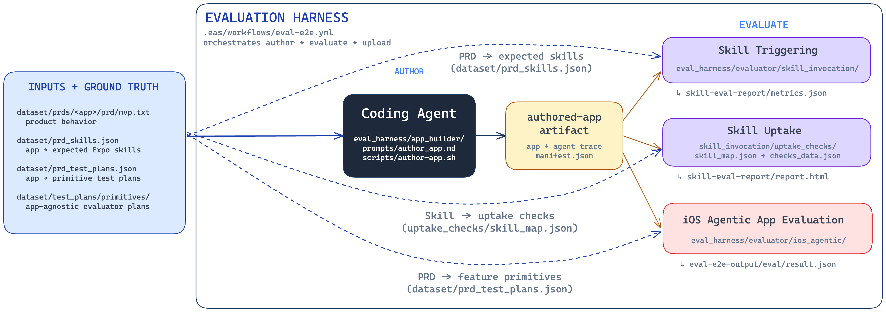

# eval-experiments

EAS-native evaluation harness for comparing coding agents on Expo app-building
tasks. The normal path is one Workflow run: a coding agent authors an Expo app
from a PRD, the app evaluator can drive it on an iOS simulator, and the v0 skill
evaluator can inspect whether Expo skills were triggered and reflected in code.

The Notes app is the canonical first target because it is small, known-good, and
has a stable primitive test plan.

## How It Fits Together



The diagram includes the repository paths for each stage. Its
[editable Excalidraw source](eval_harness/evaluation-harness.excalidraw) is kept
next to the rendered image.

## Layout

```text
.eas/workflows/
  eval-e2e.yml                # full author -> optional iOS eval -> optional skill eval
  author-app.yml              # Linux authoring replay/debug workflow
  eval-ios-app.yml            # macOS iOS evaluator replay/debug workflow
  eval-skill-use.yml          # Linux skill-use report replay/debug workflow

eval_harness/
  app_builder/
    scripts/                  # authoring + agent-skill-visibility entrypoints
  evaluator/
    ios_agentic/
      agent_device/           # agent-device bridge and tools
      maestro/                # Maestro bridge and tools
      core/                   # evaluator scoring and tracing internals
      prompts/                # agentic evaluator's system prompt
      scripts/                # iOS build+eval entrypoints
    skill_invocation/
      uptake_checks/          # atomic check registry + skill_map.json (skill -> checks)
      build_health/           # app-wide (not per-skill) syntax/bundle signals
      main.ts                 # Bun analyze-artifacts CLI
      analysis.ts             # scoring, aggregation, metrics.json, report.html
      utils.ts                # artifact unpacking, prd_skills loading, small helpers
      tests/                  # skill evaluator unit tests
      scripts/                # skill-use analysis entrypoint
  utils/                      # artifacts, iOS, shell, and telemetry helpers (shared)

dataset/
  prompts/                    # coding-agent authoring prompt variants
  prompts.json               # prompt-variant id -> prompt file registry
  prds/                       # Notes, Hot Chocolate, Wiki Reader, and Pool app PRDs (shared)
  test_plans/primitives/      # app-agnostic primitive plans
  prd_skills.json             # app -> expected skill ids (skill-eval ground truth)
  prd_test_plans.json         # app -> relevant test-plan filenames (iOS-eval ground truth)
```

## One-time Collaborator Setup

The shared harness is already linked to Georgian's Expo project and its EAS
`production` environment already contains the required credentials. If your
Expo account has been invited to that project, install the EAS CLI and sign in:

```bash
npm install -g eas-cli
eas login
eas whoami
```

From the repository root, verify that EAS resolves the shared project:

```bash
eas project:info
```

It should show:

- owner: `georgian-team`
- slug: `adi-test-project`
- project ID: `338f6455-57a3-49c9-a2e0-36e5a0577c77`

You do not need to install this repository's Bun, TypeScript, or Python
dependencies locally to submit a Workflow. EAS uploads the current checkout and
installs the required runtimes and dependencies on its remote workers.

### Project secret setup (maintainers only)

Invited collaborators can skip this subsection. When configuring a new EAS
project, copy `.env.default` to `.env` and push the required values to the EAS
`production` environment:

```bash
eas env:push production --path .env
```

Claude Code authoring and evaluation use `CLAUDE_CODE_OAUTH_TOKEN`, generated
locally with `claude setup-token`. Do not also set `ANTHROPIC_API_KEY` or
`ANTHROPIC_AUTH_TOKEN`; Claude Code gives those credentials higher priority than
subscription OAuth, and the harness rejects them to prevent accidentally
bypassing the intended Claude subscription. Codex authoring requires
`OPENAI_API_KEY`. Muse Code authoring uses `META_API_KEY` with provider `meta`
and defaults to `muse-spark-1.2`. Create that EAS secret with the interactive
prompt—never an inline value:

```bash
eas env:create production --name META_API_KEY --visibility secret --scope project
```

`EXPO_TOKEN` is optional and lets the coding agent run its own `eas build`
self-verification and use Expo MCP. `BRAINTRUST_API_KEY` and
`BRAINTRUST_PROJECT` are optional trace-export settings; see `.env.default`.

Muse author-only runs need `META_API_KEY`. A Muse E2E run that enables iOS
evaluation (`-F run_eval_ios=true`) also needs `CLAUDE_CODE_OAUTH_TOKEN`, because
the downstream iOS evaluator is always Claude-based.

Expo project routing is controlled by `app.config.js`. Override these variables
when running the same branch under another Expo account:

```bash
EAS_PROJECT_ID=<project-uuid>
EXPO_SLUG=<project-slug>
EXPO_OWNER=<account-name>
```

## Run The Full Flow

One `eval-e2e.yml` dispatch evaluates one author harness/model × PRD ×
prompt × skill-scenario cell. It authors once, runs the optional evaluators
in parallel, then waits for both terminal states and consolidates the available
evidence:

```text
author_app
   ├── eval_ios ───┐
   └── eval_skill ─├── report ── eval-report
                  ┘
```

The iOS evaluator is Python; skill analysis and final reporting are TypeScript
executed by Bun. Bun is pinned and installed automatically on EAS workers.
There is no workflow matrix today, so comparing Claude Code, Codex, and Muse
Code means dispatching this workflow separately for each cell. Cross-run
aggregation over the resulting `summary.json` files is external/future work.

First pull the branch you want to evaluate and inspect the checkout. EAS uploads
the entire current local project directory, including uncommitted files, unless
you use its `--ref` option.

```bash
git status --short
```

Start with the canonical Notes evaluation. Notes is the small, known-good
target for proving harness changes:

```bash
eas workflow:run .eas/workflows/eval-e2e.yml \
  -F agent=claude-code \
  -F agent_reasoning_effort=high \
  -F evaluator_model=claude-opus-4-8 \
  -F prd=dataset/prds/notes/prd/mvp.txt \
  -F run_eval_ios=true \
  -F run_eval_skill=true \
  -F skill_scenario=skills_available_unmentioned \
  --wait
```

`--wait` keeps the terminal attached until the workflow finishes. It is
optional; the EAS dashboard continues the run if you disconnect.

### Model, reasoning, and prompt controls

`agent_model` is optional and resolves according to the selected authoring
harness. Author reasoning is configurable and defaults to `high`. In the full
E2E workflow, the iOS evaluator runs at `high` reasoning in `release` app mode;
those two settings stay configurable in the `eval-ios-app.yml` replay workflow.

| Role | Default model | Model input | Effort input |
|---|---|---|---|
| Claude Code author | `sonnet` | `agent_model` | `agent_reasoning_effort` |
| Codex author | `gpt-5-mini` | `agent_model` | `agent_reasoning_effort` |
| Muse Code author | `muse-spark-1.2` | `agent_model` | `agent_reasoning_effort` |
| iOS evaluator | `claude-opus-4-8` | `evaluator_model` | Fixed `high` in full E2E; `evaluator_reasoning_effort` in replay |

The accepted effort values are `low`, `medium`, and `high`. For the planned
frontier-model comparison, keep the evaluator fixed at
`claude-opus-4-8`/`high` and dispatch these author settings separately:

```bash
# Claude Code cell
eas workflow:run .eas/workflows/eval-e2e.yml \
  -F agent=claude-code -F agent_model=claude-opus-5 \
  -F agent_reasoning_effort=high \
  -F evaluator_model=claude-opus-4-8 \
  -F prd=dataset/prds/notes/prd/mvp.txt -F prompt_variant=realistic \
  -F skill_scenario=skills_available_unmentioned \
  -F run_eval_ios=true -F run_eval_skill=true

# Codex cell
eas workflow:run .eas/workflows/eval-e2e.yml \
  -F agent=codex -F agent_model=gpt-5.6-sol \
  -F agent_reasoning_effort=high \
  -F evaluator_model=claude-opus-4-8 \
  -F prd=dataset/prds/notes/prd/mvp.txt -F prompt_variant=realistic \
  -F skill_scenario=skills_available_unmentioned \
  -F run_eval_ios=true -F run_eval_skill=true

# Muse Code cell
eas workflow:run .eas/workflows/eval-e2e.yml \
  -F agent=muse-code -F agent_model=muse-spark-1.2 \
  -F agent_reasoning_effort=high \
  -F evaluator_model=claude-opus-4-8 \
  -F prd=dataset/prds/notes/prd/mvp.txt -F prompt_variant=realistic \
  -F skill_scenario=skills_available_unmentioned \
  -F run_eval_ios=true -F run_eval_skill=true
```

Authoring uses `baseline` by default. The `realistic` middle-ground variant is
a three-line, product-oriented request for a complete, discoverable, polished
Expo app; it deliberately says "as an Expo app," not iPhone, because the
authored project must remain cross-platform. `minimal` supplies only the role
and task. See [`dataset/prompts/README.md`](dataset/prompts/README.md) for the
exact text and registry contract.

Authoring always uses a direct PRD path. Which test plans run in `eval_ios`,
and which skill(s) are expected in `eval_skill` (`run_eval_skill=true`), are
both resolved automatically from that same PRD — via
`dataset/prd_test_plans.json` and `dataset/prd_skills.json` respectively, no
manual test-plan or case-spec selection needed. `skill_scenario` feeds both
the authoring step (it's an enforced config, not just a label — see
`uptake_checks/README.md`) and the analysis step; `skill_mention` only matters
for the `skills_available_mentioned` scenario:

```bash
eas workflow:run .eas/workflows/eval-e2e.yml \
  -F agent=claude-code \
  -F prd=dataset/prds/notes/prd/mvp.txt \
  -F run_eval_ios=false \
  -F run_eval_skill=true \
  -F skill_scenario=skills_available_unmentioned
```

## Download And Interpret Results

Open the EAS Workflow run and download artifacts from the run’s artifact list.
The primary collaborator-facing output is `eval-report`; the other three
artifacts are producer-owned replay and diagnostic inputs. Each EAS artifact is
a same-named `.tar.gz` transport whose extracted root contains one
`manifest.json`.

| EAS artifact | Produced by | Authoritative result |
|---|---|---|
| `authored-app` | `author_app` | `manifest.json` plus the one authored workspace |
| `ios-eval-report` | `eval_ios` | `result.json` |
| `skill-eval-report` | `eval_skill` | `metrics.json` |
| `eval-report` | `report` | `summary.json` and offline `report.html` |

The iOS and skill jobs run independently after authoring. Their packaging steps
run even after a failure and create a small, truthful diagnostic artifact when
the evaluator did not reach its normal collector. Those fallback artifacts keep
the same contract (`manifest.json` plus `result.json`/`metrics.json` and
`report.html`) but contain no score. The final report receives the actual EAS
job terminal statuses, withholds scores from failed or skipped jobs, and labels
missing evidence rather than treating it as a pass. If Claude Max has reached
its session limit, authoring or iOS evaluation fails with an explicit
subscription-usage message; wait for the stated reset before retrying.

### `authored-app`

After extracting a normal `authored-app.tar.gz`:

```text
manifest.json                         # run/provenance index and producer stages
author-agent-workspace/
  <run-id>/                           # the authoritative authored Expo project
author-agent-metadata/
  <run-id>/
    author.env                        # resolved non-secret run configuration
    telemetry/
      anthropic.jsonl | openai.jsonl  # provider proxy telemetry when applicable
      otel/                           # OTLP exports when produced
      traces/
        claude-code-authoring.json |
        codex-authoring.json |
        muse-code-authoring.json      # exactly the selected harness trace
    logs/                             # authoring-stage stdout/stderr
```

Only this artifact carries source or the author trace. There is no second
`app/` copy and no nested per-run tar. Reproducible build products, credentials,
MCP settings, raw Muse XDG state, and installed Muse binaries are excluded.
Muse uses its native Meta endpoint; its normalized native session is the
supported trace source.

### `ios-eval-report`

After extracting a normally completed `ios-eval-report.tar.gz`:

```text
manifest.json                         # evaluator provenance and producer stages
result.json                           # authoritative suite/plan/step/assertion result
report.html                           # standalone iOS diagnostic report
traces/
  agentic-evaluator.json              # normalized overall evaluator session
  test-plans/
    <plan-run>/
      summary.json                    # score, steps, and usage for one invocation
      conversation.jsonl              # evaluator-native turn/tool events
      console.log                     # that invocation's console transcript
      screenshots/
        step-01-final.png             # deterministic terminal-step evidence
telemetry/
  anthropic.jsonl                     # redacted usage log, when produced
  otel/                               # evaluator OTLP exports, when produced
logs/                                 # dependency/build/launch/evaluation stage logs
```

The overall normalized trace and per-plan native traces serve different levels
of inspection. This artifact does not repeat the author workspace or author
trace, and each result, report, telemetry stream, and log has one location.
Start with `macro_avg_pct`, then inspect plan scores and assertion details; an
agent-driven evaluation can reveal driver limitations as well as app defects.

Authored dependency hooks, Expo config/build commands, and Metro run behind an
environment-only credential boundary. Each subprocess starts with an empty
environment and receives only an explicit set of OS/toolchain/build variables
plus deliberate `EXPO_PUBLIC_*` values; arbitrary EAS and production variables
are not inherited. This prevents ambient evaluator credentials and opaque
connection values from reaching app-controlled subprocesses, but it is not a
filesystem, network, or operating-system sandbox; those subprocesses still run
as the evaluator worker user.

The evaluator receives an optional `capture_screenshot` tool, but that tool
returns only a filesystem path. Claude's file-reading tools are blocked and no
pixels are returned, so it cannot visually inspect the image. It reasons and
scores from the accessibility tree and structured assertion tools. Independently
of model tool use, the harness captures one best-effort final-state PNG after
each scored step completes or aborts, attaches the relative path to that step,
and keeps capture failures non-fatal. These images are human postmortem context,
not scoring evidence.

### `skill-eval-report`

After extracting a normally completed `skill-eval-report.tar.gz`:

```text
manifest.json                         # result inventory and source run id
metrics.json                          # authoritative trigger/uptake/build-health data
report.html                           # standalone skill diagnostic report
```

Open `report.html` for a compact view. In `metrics.json`, check whether every
expected skill triggered, review each skill's independent uptake rate and
failed-check evidence, and inspect syntax and Expo-export results. Checks marked
`not_applicable` are excluded rather than counted as failures. The analyzer's
temporary extraction tree is outside this artifact and is deleted after use.

The skill evaluator remains a deterministic v0 signal: structured trace trigger
detection, static code uptake checks, and optional app-evaluator outcome when a
replay supplies one. It has no LLM judge and does not itself consume screenshot
evidence. In a full E2E run, iOS and skill evaluation are parallel, so the
standalone skill report normally leaves its optional app outcome pending; the
final `eval-report` combines both producer results downstream.

### `eval-report`

After extracting `eval-report.tar.gz`:

```text
manifest.json                         # final artifact inventory
report.html                           # polished static report; opens offline
summary.json                          # normalized machine result for this one cell
data/
  author-manifest.json                # exact producer manifest
  skill-metrics.json                  # exact metrics.json, when supplied
  ios-result.json                     # exact result.json, when supplied
  build-health.json                   # normalized seven-stage ladder
evidence/
  screenshots/
    <stable-relative-name>.png         # only PNGs referenced by the report
```

`report.html` contains run/model provenance, headline scores, the build and
evaluation ladder, skill and iOS flow summaries, failed-step screenshots before
passing previews, assertion/check detail, usage, tool and skill-read telemetry,
warnings, and links to the machine data. It has no remote assets and all links
are relative.

`summary.json` is the durable one-cell aggregation input. Missing metrics remain
`null`, never zero. `data/build-health.json` is reduced from outcomes the
producers already record; there is no generic pipeline-event recorder:

1. App authored / required output present
2. Dependency install
3. Source syntax parse
4. Expo iOS bundle export
5. Native iOS build
6. App install and launch readiness
7. iOS evaluation completion

The final artifact intentionally contains no authored source, raw traces, logs,
provider credentials, Muse state, MCP settings, or original transport archives.
Only directly consumed JSON and referenced screenshots are copied. Screenshot
retention is uncapped for the first runs; monitor artifact size from the actual
archives and revisit if the evidence materially increases it.

### Artifact materialization and compatibility

Active workflows use the shared hardened materializer rather than raw tar
extraction. It accepts EAS download directories, direct archives,
canonical/nested roots, and supported legacy layouts, stages a clean
replacement, and rejects path traversal, escaping links, unsafe file types, and
ambiguous roots. New writers emit only the canonical layouts above; legacy
support is read-only so prior artifacts remain replayable.

## Debug Workflows

Use `author-app.yml` when you only want to test coding-agent setup, Expo skill
availability, or trace capture without spending macOS build minutes. No test
plan is needed for author-only runs.

```bash
eas workflow:run .eas/workflows/author-app.yml \
  -F agent=claude-code \
  -F prd=dataset/prds/notes/prd/mvp.txt
```

For Muse Code authoring only (no macOS evaluator), use:

```bash
eas workflow:run .eas/workflows/author-app.yml \
  -F agent=muse-code \
  -F prd=dataset/prds/notes/prd/mvp.txt
```

Use `eval-ios-app.yml` to replay the iOS/evaluator half against a previously
uploaded `authored-app` artifact after changing evaluator, build, restart, or
probe logic. It accepts an EAS artifact ID or signed URL and uploads the same
canonical `ios-eval-report` contract as the full flow. Unlike the full E2E
workflow, the replay entrypoint exposes `ios_app_mode` and
`evaluator_reasoning_effort` for focused diagnostics.

Use `eval-skill-use.yml` to replay the skill-use analyzer against a prior
`authored-app` artifact, optionally with an `ios-eval-report` artifact. It also
accepts EAS artifact IDs or signed URLs and uploads the same canonical
`skill-eval-report` contract. Replay workflows do not produce the consolidated
`eval-report`; use the full E2E workflow for the collaborator-facing report.

## Braintrust

If `BRAINTRUST_API_KEY` is set, reconstructed authoring and evaluator sessions
are pushed to Braintrust. The default project is `expo-evals`; override with
`BRAINTRUST_PROJECT`, `BRAINTRUST_CC_PROJECT`, or `BRAINTRUST_EVAL_PROJECT`.
The legacy evaluator-trace mirror is disabled unless `PUSH_EVAL_TRACE_BT=1`.

## Development

The private [`source-scan`](packages/source-scan/README.md) workspace provides
comment stripping, Babel parsing, and AST walking for the existing skill analyzer.
It is not published separately; downstream packages bundle the shared utilities.
Shared external versions live in the root `catalog`; each package declares its
own dependencies using `catalog:`. Internal dependencies use `workspace:*`.

```bash
bun install             # installs workspaces and builds shared utilities
bun run build           # rebuild after changing source
bun run test:packages   # source-scan unit tests
```

Workspace exports reference compiled ESM and declarations under `build/`.
Run `bun run build` explicitly if installation hooks were disabled.

The app evaluator can still be run locally against an already served app when
debugging driver behavior, but collaborators should start with EAS workflows
because they match the runner environment.

Language-independent behavioral properties live in
[the property catalog](test_properties.json), whose structure is defined by
[the catalog schema](test_properties.schema.json).

```bash
uv run python -m eval_harness.evaluator.ios_agentic.main \
  dataset/test_plans/primitives/test_insert.txt \
  --prd dataset/prds/notes/prd/mvp.txt \
  -d agent-device \
  --hybrid-restart \
  -o /tmp/notes-result.json \
  --verbose
```

Run shell parse checks after touching harness scripts:

```bash
find eval_harness -name '*.sh' -print0 | xargs -0 bash -n
```

[GitHub Actions](.github/workflows/test.yml) runs `bun run format:check`,
`bun run typecheck`, and `bun run test:ts` on pull requests, pushes to `main`, and merge-queue commits.
This covers the harness and workspace package tests, including source-scan,
using Bun 1.3.14 and Node 22.17. Tests use fake agent runners and need no model
credentials. The Python suite remains a separate local check.

Run `bun run format` before committing package or tooling changes. The pinned
[oxfmt](https://oxc.rs/docs/guide/usage/formatter) version and `.oxfmtrc.json`
keep formatting consistent for `packages/`, `.github/`, root JavaScript/TypeScript
scripts, and the root package/TypeScript/formatter configs. Build outputs and the
analyzer's golden metric/manifest files are excluded. Existing harness and dataset
files are outside this initial formatting scope.

Run the canonical local type-check and test suite after changing harness code:

```bash
bun run test:all
```

For focused debugging, run the skill evaluator and iOS test-plan-resolution
tests separately:

```bash
bun test eval_harness/evaluator/skill_invocation/tests
PYTHONPATH=. uv run python -m unittest eval_harness.evaluator.ios_agentic.tests.test_test_plan_resolution
```

To add static uptake coverage for another Expo skill, follow the
[uptake-check contributor guide](eval_harness/evaluator/skill_invocation/uptake_checks/README.md#contributor-guide-add-coverage-for-another-skill).

Validate EAS workflows:

```bash
node /Users/adityashukla/.codex/plugins/cache/openai-curated-remote/expo/1.0.2/skills/expo-cicd-workflows/scripts/validate.js .eas/workflows/*.yml
```
